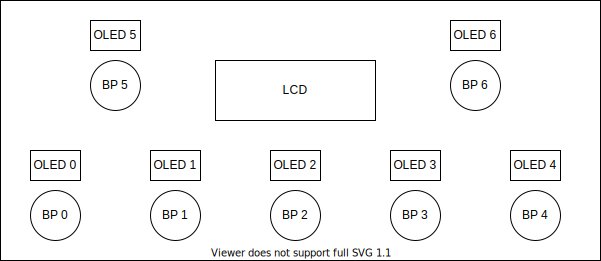
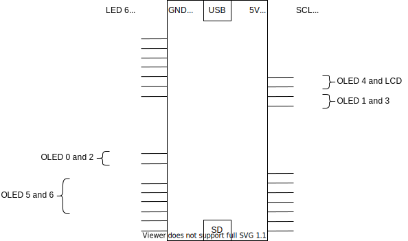

# KatanaController

## Intro
Home made USB foot controller for the Boss Katana MK2 50 guitar amplifier. This awesome amplifer has plenty of built-in effects and presets, the aim of this project is to controle most of it from some foot switches.

## Features

### Working
- Enable/Disable effects
- Recall presets
- Change amp type
- Mute

### To do
- [ ] Load presets from an SD card onto the amp
- [ ] Store presets from the amp to an SD card
- [ ] Change effect color
- [ ] Change effect type

## Hardware
- Teensy 4.1
- 1 * 20x4 LCD (HD44780)
- 7 * push buttons with led
- 7 * 128X64 OLED (SSD1306)

### Assembly drawing

### Teensy 4.1 wiring diagram

